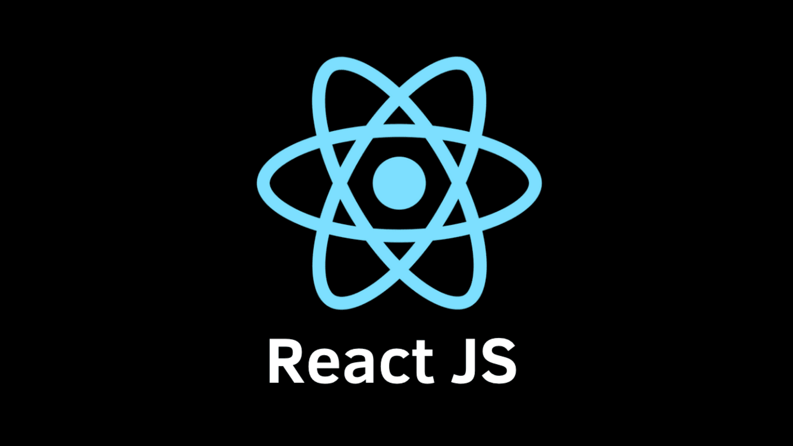

# Hey, welcome to my GitHub profile!

 

 

 
 

#### Thanks for stopping by! My name is Rishabh Goyal, and I am a pre-final student studying Computer Engineering at [Thapar Institute of Engineering and Technology, Patiala](https://www.thapar.edu/).I am looking forward to learning and collaborating with everyone!

 
 

### A brief introduction about me -
* 🌎I am currently exploring the vast world of Web Development and Machine Learning
* 👨🏽‍💻Working with technologies like ReactJs and Python
* 🪥Brushing up my problem solving skills through DSA practice in C++
* 📕I am an avid reader
* 🎨I have been drawing all my life!

 
 

### Here are the languages and tools I am familiar with -

 
 

### You can contact me through 📝-

 
 

### An overview of my work on GitHub -

 

 

